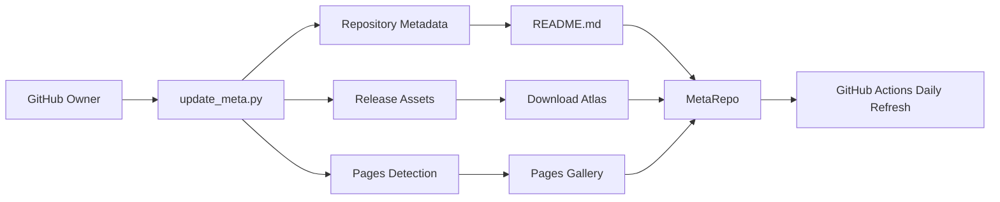

<div align="center">

# Build Your MetaRepo

Turn a GitHub account into a living map of its repositories: downloads, releases, Pages, skills, forks, and project categories, refreshed by GitHub Actions.

[Skill](./SKILL.md) | [Builder Script](./scripts/build_meta_repo.py) | [Blueprint](./references/meta_repo_blueprint.md)


</div>

## Why MetaRepo

A mature GitHub account stops being a list of repositories. It becomes a small ecosystem: apps with APK or EXE downloads, GitHub Pages demos, skills, forks, experiments, release notes, and half-finished ideas that still matter.

GitHub gives each repository a home, but it does not give the whole ecosystem a home. A **MetaRepo** fills that gap.

A MetaRepo is a repository that treats other repositories as data. It fetches metadata, classifies projects, generates readable indexes, publishes a GitHub Pages surface, and updates itself as the owner adds or removes work. In practice, it becomes the living front door for a GitHub identity.

This project uses **MetaRepo** as a first-class pattern:

- repository metadata becomes structured data;
- release assets become download maps;
- GitHub Pages become a visual gallery;
- skills and workflows become a searchable registry;
- forks stay visible without crowding original work;
- GitHub Actions keep the whole thing current.

## What It Builds

| Output Repository | Purpose |
|---|---|
| `<owner>-project-atlas` | Download-first atlas for APK, EXE, package, archive, VSIX, and other release assets. |
| `<owner>-release-hub` | Latest GitHub releases, direct assets, version pages, and release cadence. |
| `<owner>-pages-hub` | Visual GitHub Pages gallery for demos, docs, and live project surfaces. |
| `<owner>-skills-hub` | Codex skills, workflow skills, prompt recipes, and agent operating procedures. |

Each generated hub includes:

- `scripts/update_meta.py` for live GitHub metadata refresh;
- `.github/workflows/update-meta.yml` for daily and manual updates;
- `.github/workflows/deploy-pages.yml` for GitHub Pages;
- `data/repos.json`, `data/classified.json`, and mode-specific JSON;
- a polished `README.md` designed as the repository homepage;
- `docs/index.html` as a generated visual surface.

## Quick Start

```powershell
python scripts/build_meta_repo.py --owner Harzva --output D:\work\meta-repos
```

Create only one hub:

```powershell
python scripts/build_meta_repo.py --owner Harzva --mode atlas --output D:\work\meta-repos
```

Generate scaffolds without fetching GitHub:

```powershell
python scripts/build_meta_repo.py --owner Harzva --no-fetch --output D:\work\meta-repos
```

## System Flow



## Naming

The repository name is intentionally lowercase: `build-your-meta-repo-skill`.

Lowercase is better for clone URLs, shell commands, package references, and Codex skill invocation. The product name in prose is **Build Your MetaRepo**, and the pattern name is **MetaRepo**.

## Privacy Model

Public mode is the default. Private repository names, descriptions, local machine paths, and private release metadata are not published unless you explicitly enable private mode.

For private coverage, keep the generated MetaRepo private and set:

```powershell
$env:META_INCLUDE_PRIVATE = "true"
$env:META_GITHUB_TOKEN = "<token>"
```

In GitHub Actions, store the token as `META_GITHUB_TOKEN`.

## Validation

```powershell
python -m py_compile scripts/build_meta_repo.py scripts/update_meta_template.py
```

The skill metadata also validates with Codex's skill validator.

## License

MIT
